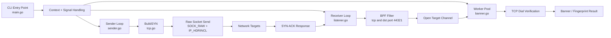

# SynKinetik

SynKinetik is a high-performance asynchronous TCP SYN scanner prototype for macOS Apple Silicon. It separates raw packet injection, packet capture, and service verification into independent loops so each stage can be tuned without blocking the others.

This project is intended for authorized security testing only. Run it only against systems you own or have explicit permission to assess.

## Use Case

SynKinetik is designed for fast discovery of open TCP services:

1. Craft TCP SYN packets manually.
2. Inject them through a raw socket.
3. Capture SYN-ACK replies with a pcap listener and BPF filter.
4. Treat SYN-ACK replies as open-port candidates.
5. Verify candidates with normal TCP connections.
6. Pass verified services into banner fingerprinting logic.

The current repository is a compact `package main` prototype. The major components are:

| File | Purpose |
| --- | --- |
| `main.go` | Starts cancellation handling, worker pool, receiver loop, and sender loop. |
| `tcp.go` | Builds raw IPv4/TCP SYN packets with `gopacket`. |
| `sender.go` | Opens a raw socket and sends crafted packets. |
| `listener.go` | Captures SYN-ACK packets using pcap and a BPF filter. |
| `banner.go` | Runs concurrent workers that verify open targets with `net.DialTimeout`. |
| `target.go` | Defines the target IP and port model. |
| `build.sh` | Builds the binary with Homebrew CGO include and library paths. |

## Architecture Flow



## Packet Flow

```text
SynKinetik host                         Target service
----------------                         --------------
SenderLoop
  Build IPv4 + TCP SYN  ------------->   Receives SYN

ReceiverLoop
  pcap listens for       <-------------   Sends SYN-ACK if port is open
  SYN-ACK to source port

WorkerPool
  net.DialTimeout        ------------->   Performs normal TCP verification
  banner probe
```

## Prerequisites

SynKinetik currently targets:

- macOS on Apple Silicon.
- Go installed.
- Homebrew installed under `/opt/homebrew`.
- `libpcap` headers and libraries available through Homebrew or the macOS toolchain.
- Permission to open raw sockets and pcap capture handles.
- A valid network interface name, currently hardcoded as `en0` in `main.go`.
- A valid local source IP, currently hardcoded as `192.168.1.100` in `main.go`.

Install common dependencies:

```bash
brew install libpcap
go mod download
```

## Build

Use the included build script:

```bash
./build.sh
```

The script runs:

```bash
CGO_CFLAGS="-I/opt/homebrew/include" \
CGO_LDFLAGS="-L/opt/homebrew/lib" \
go build -o synkinetik .
```

## Configure Before Running

Edit `main.go` before a live test:

```go
iface := "en0"
srcIP := net.ParseIP("192.168.1.100")
testTargets := []Target{{IP: net.ParseIP("8.8.8.8"), Port: 53}}
```

Recommended changes:

- Set `iface` to your active network interface.
- Set `srcIP` to the real IPv4 address assigned to that interface.
- Set `testTargets` to a host and port you are authorized to scan.

Find your interface and IP on macOS:

```bash
ifconfig
```

## Run

Raw sockets and pcap usually require elevated privileges:

```bash
sudo ./synkinetik
```

Expected behavior:

- The receiver starts listening on the configured interface.
- The sender transmits crafted SYN packets to configured targets.
- SYN-ACK responses are forwarded to the worker pool.
- Verified open services are logged.

Example log line:

```text
[+] Open Target Found & Verified: 192.168.1.10:80
```

## Testing

### Unit Testing

The best first unit test target is `BuildSYN` in `tcp.go` because it does not require root privileges or live network access.

Recommended assertions:

- The packet decodes as IPv4 and TCP.
- Source IP and destination IP match the inputs.
- Source port and destination port match the inputs.
- The SYN flag is set.
- The ACK flag is not set.
- IPv4 protocol is TCP.
- Packet serialization succeeds with computed checksums.

Run tests with:

```bash
go test ./...
```

### Integration Testing

Live sender and receiver testing needs root privileges and a real network target.

In one terminal, run a packet capture:

```bash
sudo tcpdump -i en0 'tcp port 44321'
```

In another terminal, run SynKinetik:

```bash
sudo ./synkinetik
```

For a safer first integration test, use a host you control on your LAN with a known open TCP port.

## Current Limitations

- Interface, source IP, source port, and targets are currently hardcoded in `main.go`.
- The sender does not yet implement rate limiting.
- The TCP sequence number and IP ID are static.
- Banner fingerprinting is currently a verification stub.
- The pcap filter currently checks for ACK and the Go code checks for SYN plus ACK.
- There is no CLI argument parsing yet.
- There are no automated tests checked in yet.

## Next Enhancements

Useful next implementation steps:

- Add CLI flags for interface, source IP, target host/range, port list, and concurrency.
- Add a unit test suite for `BuildSYN`.
- Add rate limiting and jitter for the sender loop.
- Randomize source port, TCP sequence number, and IP ID where appropriate.
- Add structured JSON or table output.
- Expand banner grabbing and regex fingerprint signatures.
- Split the prototype into `cmd/synkinetik` and `pkg/...` packages as the codebase grows.
