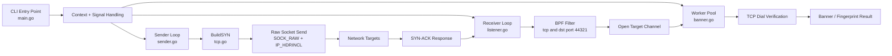

# SynKinetik

SynKinetik is a high-performance asynchronous TCP SYN scanner prototype for macOS and Linux, including Ubuntu 24.04 and Rocky Linux. It separates raw packet injection, packet capture, and service verification into independent loops so each stage can be tuned without blocking the others.

This project is intended for authorized security testing only. Run it only against systems you own or have explicit permission to assess.

## Use Case

SynKinetik is designed for fast discovery of open TCP services:

1. Craft TCP SYN packets manually.
2. Inject them through a raw socket.
3. Capture SYN-ACK replies with a pcap listener and BPF filter.
4. Treat SYN-ACK replies as open-port candidates.
5. Verify candidates with normal TCP connections.
6. Pass verified services into banner fingerprinting logic.

The current repository is a compact `package main` prototype. The major components are:

| File | Purpose |
| --- | --- |
| `main.go` | Parses CLI configuration, starts cancellation handling, worker pool, receiver loop, and sender loop. |
| `tcp.go` | Builds raw IPv4/TCP SYN packets with `gopacket`. |
| `sender.go` | Opens a raw socket and sends crafted packets. |
| `listener.go` | Captures SYN-ACK packets using pcap and a BPF filter. |
| `banner.go` | Runs concurrent workers that verify open targets with `net.DialTimeout`. |
| `target.go` | Defines the target IP and port model. |
| `build.sh` | Builds the binary with platform-aware libpcap flags. |

## Architecture Flow



## Packet Flow

```text
SynKinetik host                         Target service
----------------                         --------------
SenderLoop
  Build IPv4 + TCP SYN  ------------->   Receives SYN

ReceiverLoop
  pcap listens for       <-------------   Sends SYN-ACK if port is open
  SYN-ACK to source port

WorkerPool
  net.DialTimeout        ------------->   Performs normal TCP verification
  banner probe
```

## Prerequisites

SynKinetik currently targets:

- macOS on Apple Silicon or Intel.
- Linux distributions with raw socket and libpcap support, including Ubuntu 24.04 and Rocky Linux.
- Go installed.
- `libpcap` headers and libraries available through the OS package manager or the macOS toolchain.
- Permission to open raw sockets and pcap capture handles.
- A valid non-loopback IPv4 network interface. SynKinetik auto-detects one by default, or you can pass it with `-iface`.

Install dependencies on macOS:

```bash
brew install libpcap redis
go mod download
```

Install dependencies on Ubuntu 24.04:

```bash
sudo apt update
sudo apt install -y build-essential pkg-config libpcap-dev redis-server
go mod download
```

Install dependencies on Rocky Linux:

```bash
sudo dnf install -y gcc pkgconf-pkg-config libpcap-devel redis
go mod download
```

## Build

Use the included build script:

```bash
./build.sh
```

The script runs:

```bash
go build -o synkinetik .
```

On macOS, the script adds Homebrew include/library paths when `/opt/homebrew` exists. On Linux, it uses `pkg-config libpcap` when available.

## Configure Before Running

SynKinetik now accepts runtime flags:

```bash
./synkinetik \
  -iface eth0 \
  -src-ip 192.168.1.100 \
  -listen-port 44321 \
  -targets 8.8.8.8:53,1.1.1.1:80 \
  -workers 50
```

All flags are optional except `-targets` if you want to scan anything other than the default `8.8.8.8:53`.

- `-iface`: capture interface. Auto-detected when omitted.
- `-src-ip`: local IPv4 source address. Auto-detected from the interface when omitted.
- `-listen-port`: local TCP source port used for crafted SYN packets.
- `-targets`: comma-separated IPv4 targets in `host:port` format.
- `-workers`: number of TCP verification workers.

Find your interface and IP on macOS or Linux:

```bash
ifconfig
ip addr
```

## Run

Raw sockets and pcap usually require elevated privileges:

```bash
sudo ./synkinetik
```

On Linux, you can also grant the binary the packet privileges it needs:

```bash
sudo setcap cap_net_raw,cap_net_admin=eip ./synkinetik
./synkinetik -targets 8.8.8.8:53
```

## DNS lookup integration

The scanner now supports a dedicated subcommand-style interface for structured operation modes.

```bash
# run only the scanner
go run . scan

# run only the DNS lookup service
go run . dnslookup -dns-lookup-config dnslookup/lookup.conf

# run both scanner and DNS lookup together
go run . all -dns-lookup-config dnslookup/lookup.conf
```

Existing flags still work without subcommands, for example:

```bash
go run . -mode dnslookup -dns-lookup-config dnslookup/lookup.conf
```

When no config path is provided, the embedded DNS lookup service will fall back to the system default at `/etc/synkinetik/lookup.conf`.

Expected behavior:

- The receiver starts listening on the configured interface.
- The sender transmits crafted SYN packets to configured targets.
- SYN-ACK responses are forwarded to the worker pool.
- Verified open services are logged.

Example log line:

```text
[+] Open Target Found & Verified: 192.168.1.10:80
```

## Testing

### Unit Testing

The best first unit test target is `BuildSYN` in `tcp.go` because it does not require root privileges or live network access.

Recommended assertions:

- The packet decodes as IPv4 and TCP.
- Source IP and destination IP match the inputs.
- Source port and destination port match the inputs.
- The SYN flag is set.
- The ACK flag is not set.
- IPv4 protocol is TCP.
- Packet serialization succeeds with computed checksums.

Run tests with:

```bash
go test ./...
```

### Integration Testing

Live sender and receiver testing needs root privileges and a real network target.

In one terminal, run a packet capture:

```bash
sudo tcpdump -i eth0 'tcp port 44321'
```

In another terminal, run SynKinetik:

```bash
sudo ./synkinetik
```

For a safer first integration test, use a host you control on your LAN with a known open TCP port.

## Current Limitations

- Target parsing currently supports comma-separated IPv4 `host:port` values only.
- The sender does not yet implement rate limiting.
- The TCP sequence number and IP ID are static.
- Banner fingerprinting is currently a verification stub.
- The pcap filter currently checks for ACK and the Go code checks for SYN plus ACK.
- There are no automated tests checked in yet.

## Next Enhancements

Useful next implementation steps:

- Add CIDR/range expansion and richer port list parsing.
- Add a unit test suite for `BuildSYN`.
- Add rate limiting and jitter for the sender loop.
- Randomize source port, TCP sequence number, and IP ID where appropriate.
- Add structured JSON or table output.
- Expand banner grabbing and regex fingerprint signatures.
- Split the prototype into `cmd/synkinetik` and `pkg/...` packages as the codebase grows.
